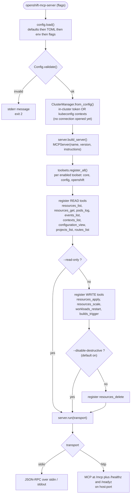
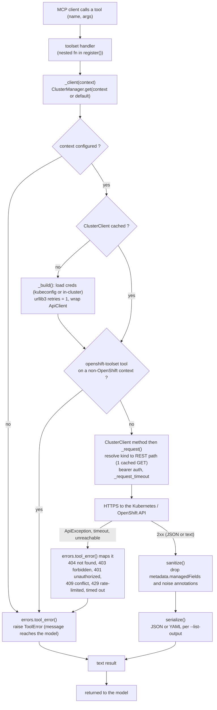
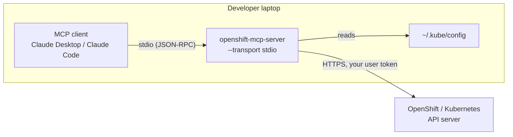
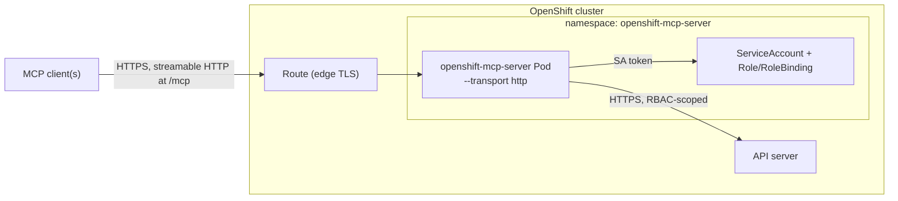
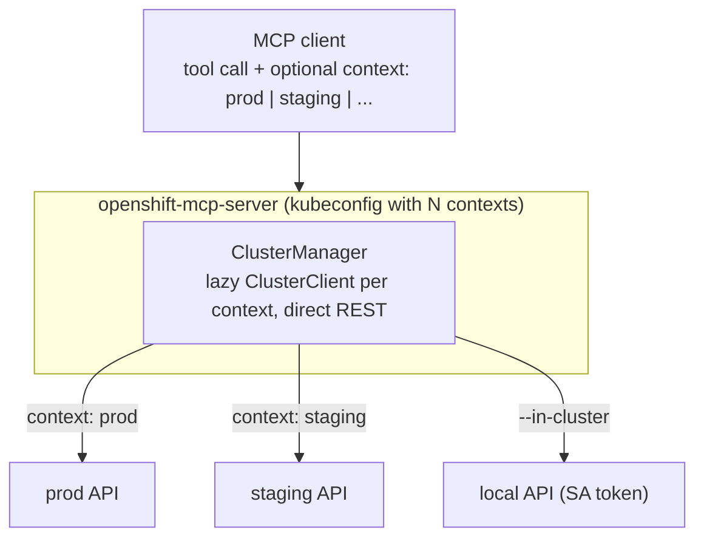

# openshift-mcp-server

An [MCP](https://modelcontextprotocol.io) server, written in Python on the official MCP SDK's
`MCPServer` (`mcp` ≥ 2.1 — the class FastMCP became when it moved into the SDK), that exposes
OpenShift/Kubernetes cluster operations as tools for MCP clients (Claude Desktop, Claude Code,
and others).

It talks to the cluster API **directly** — no `oc`/`kubectl` on the host — and is built around a
small set of **generic resource tools** rather than one tool per kind.

| Config | Tools | Surface |
|---|--:|---|
| default | 12 | reads + non-destructive writes (apply, scale, restart, trigger) |
| `--read-only` | 8 | list / get / log only |
| `--no-disable-destructive` | 13 | default + `resources_delete` |
| `--toolsets core` | 6 | `core` toolset only |

## How it works

- **Generic resource tools.** `resources_list` / `resources_get` / `resources_apply` /
  `resources_scale` / `resources_delete` operate on *any* GVK (`kind` + `apiVersion`), including
  CRDs and OpenShift types. A few specials stay dedicated: `pods_log`, `events_list` (ordering),
  `workloads_restart`, `builds_trigger` (subresources).
- **Toolsets.** Tools are grouped and enabled with `--toolsets`:

  | Toolset | Default | Tools |
  |---|---|---|
  | `core` | ✓ | `resources_list`, `resources_get`, `resources_apply`, `resources_scale`, `resources_delete`, `pods_log`, `events_list` |
  | `config` | ✓ | `contexts_list`, `configuration_view` |
  | `openshift` | ✓ | `projects_list`, `routes_list`, `workloads_restart`, `builds_trigger` |

  The `openshift` tools are always registered when the toolset is enabled; each one
  checks the target context at call time and returns a clear error if it is not an
  OpenShift cluster (the `route.openshift.io` API group is absent).

- **Two safety gates.** `--read-only` registers only the list/get/log tools.
  `--disable-destructive` (default **on**) withholds `resources_delete`. So the default surface is
  *read + non-destructive writes* (apply, scale, restart, trigger); nothing deletes.
- **Result hygiene.** Every returned object is stripped of `metadata.managedFields` and a few
  tool-written noise annotations (`last-applied-configuration`, `kapp.k14s.io/*`) before it
  reaches the model — typically 50–70% smaller, with no loss of signal. List tools are capped
  (`--list-limit`), `events_list` is sorted newest-first before truncation, and `pods_log` is
  tail-capped (`--log-max-lines`).
- **Multi-cluster** via kubeconfig contexts. Every tool takes an optional `context` argument;
  `contexts_list` names them (add `probe=true` to also check reachability + OpenShift, done
  concurrently). Per-context clients are built lazily, resolving a kind to its REST path costs
  one cached request, and every call is time-bounded (`--request-timeout`) — an unreachable
  cluster fails in seconds, never hangs.
- **Transports:** `stdio` (local clients) and streamable **HTTP** (`--transport http`), the latter
  serving the MCP endpoint at `/mcp` plus `/healthz` and `/readyz`.

## Tools

Every tool is a nested function inside its toolset's `register()`; the line
numbers below point at that `def`. "Kind" drives the safety gates (see above):
*read* tools always register, *write* tools are withheld by `--read-only`, and
the *destructive* tool additionally needs `--no-disable-destructive`.

| Tool | Toolset | Source | Kind | Registered when | Cluster call |
|---|---|---|---|---|---|
| `resources_list` | `core` | [`toolsets/core.py:69`](src/openshift_mcp/toolsets/core.py#L69) | read | core enabled | `ClusterClient.list` |
| `resources_get` | `core` | [`toolsets/core.py:107`](src/openshift_mcp/toolsets/core.py#L107) | read | core enabled | `ClusterClient.get` |
| `pods_log` | `core` | [`toolsets/core.py:122`](src/openshift_mcp/toolsets/core.py#L122) | read | core enabled | `ClusterClient.pod_logs` (`pods/log` subresource) |
| `events_list` | `core` | [`toolsets/core.py:153`](src/openshift_mcp/toolsets/core.py#L153) | read | core enabled | `ClusterClient.list` + newest-first sort |
| `resources_apply` | `core` | [`toolsets/core.py:196`](src/openshift_mcp/toolsets/core.py#L196) | write | core enabled, not `--read-only` | `ClusterClient.apply` (server-side apply) |
| `resources_scale` | `core` | [`toolsets/core.py:221`](src/openshift_mcp/toolsets/core.py#L221) | write | core enabled, not `--read-only` | `ClusterClient.patch` (merge patch on `spec.replicas`) |
| `resources_delete` | `core` | [`toolsets/core.py:266`](src/openshift_mcp/toolsets/core.py#L266) | destructive | core enabled, not `--read-only`, **`--no-disable-destructive`** | `ClusterClient.delete` |
| `contexts_list` | `config` | [`toolsets/config.py:21`](src/openshift_mcp/toolsets/config.py#L21) | read | config enabled | `ClusterManager.describe` (`probe=true` contacts every cluster) |
| `configuration_view` | `config` | [`toolsets/config.py:37`](src/openshift_mcp/toolsets/config.py#L37) | read | config enabled | none (reports local config) |
| `projects_list` | `openshift` | [`toolsets/openshift.py:57`](src/openshift_mcp/toolsets/openshift.py#L57) | read (OpenShift) | openshift enabled | `ClusterClient.list` on `project.openshift.io/v1` |
| `routes_list` | `openshift` | [`toolsets/openshift.py:73`](src/openshift_mcp/toolsets/openshift.py#L73) | read (OpenShift) | openshift enabled | `ClusterClient.list` on `route.openshift.io/v1` |
| `workloads_restart` | `openshift` | [`toolsets/openshift.py:109`](src/openshift_mcp/toolsets/openshift.py#L109) | write (OpenShift/K8s) | openshift enabled, not `--read-only` | `ClusterClient.patch` (touch `restartedAt` template annotation) |
| `builds_trigger` | `openshift` | [`toolsets/openshift.py:128`](src/openshift_mcp/toolsets/openshift.py#L128) | write (OpenShift) | openshift enabled, not `--read-only` | `ClusterClient.instantiate` (`buildconfigs/instantiate`) |

Supporting (not tools): `toolsets/__init__.py:register_all` decides which
toolsets load, `server.py:build_server` wires them onto the `MCPServer`, and
`k8s.py:ClusterClient` is the direct-REST surface every tool ultimately calls.

## How it flows

### Startup — config to a running transport

`cli.main` resolves the config, then `server.run` builds the `MCPServer` and
registers exactly the tools the safety gates allow before serving a transport.



### One tool call — request to result

The resource-touching handlers all follow the same path: resolve the context to
a (lazily built, cached) `ClusterClient`, make one bounded REST call, then
sanitize and serialize the result. Any failure becomes a readable `ToolError`.
(`configuration_view` is the one exception — it reports local config and makes no
call; `events_list` adds a newest-first sort before sanitizing.)



## Architecture

### A — local, stdio (single developer)

The MCP client launches the server as a child process and talks over stdin/stdout. It reuses
your `~/.kube/config`; nothing is exposed on the network.



### B — in-cluster, streamable HTTP (shared)

One Deployment per cluster, authenticating as its ServiceAccount, so its reach is exactly the
RBAC in `deploy/role.yaml`. Put an auth proxy in front of the Route (see [Security](#security)).



### C — one server, many clusters

A single server (local or in-cluster) resolves the tool's optional `context` argument to a
kubeconfig context; `contexts_list` enumerates them. Clients are lazy and cached per context.



## Authentication

The server implements no authorization of its own — it acts with whatever credentials it runs
with, and RBAC is the only boundary. Credential source, in order:

1. **`--in-cluster`** or, when no kubeconfig is found, the pod's mounted ServiceAccount.
2. **kubeconfig** — `--kubeconfig` / `KUBECONFIG` / `~/.kube/config`, honoring `--context`.
   Every context in the file is selectable via the `context` tool argument.

## Install & run

Requires **Python ≥ 3.11** (the container image and CI use 3.12).

```sh
python -m venv .venv && . .venv/bin/activate      # Windows: .venv\Scripts\activate
pip install -e ".[dev]"

make test        # pytest  (37 tests, no cluster needed)
make lint        # ruff check + format --check
make run         # stdio
make run-http    # http on 127.0.0.1:8080
```

`pip install` puts an `openshift-mcp-server` console script on the venv's `PATH`
(`.venv/bin/openshift-mcp-server`); `python -m openshift_mcp` is equivalent.

Tested with `mcp` 2.1.1, `kubernetes` 36, `pyyaml` 6 on CPython 3.12.

### Configuration

Flags win over `MCP_*` env vars over a `--config` TOML file over defaults. The TOML
file may be a flat table or a `[server]` table; keys use `-` or `_`.

| Flag | Env | Default | Purpose |
|---|---|---|---|
| `--config` | — | — | path to a TOML config file |
| `--transport` | `MCP_TRANSPORT` | `stdio` | `stdio` or `http` |
| `--host` / `--port` | `MCP_HOST` / `MCP_PORT` | `127.0.0.1` / `8080` | HTTP listen address |
| `--kubeconfig` | `KUBECONFIG` | *(discovery)* | kubeconfig path |
| `--context` | `MCP_CONTEXT` | *(active context)* | default context |
| `--in-cluster` | `MCP_IN_CLUSTER` | `false` | force ServiceAccount creds |
| `--read-only` | `MCP_READ_ONLY` | `false` | only list/get/log tools |
| `--disable-destructive` / `--no-disable-destructive` | `MCP_DISABLE_DESTRUCTIVE` | `true` | withhold `resources_delete` |
| `--toolsets` | `MCP_TOOLSETS` | `core,config,openshift` | enabled toolsets |
| `--list-limit` | `MCP_LIST_LIMIT` | `200` | max items per list |
| `--log-max-lines` | `MCP_LOG_MAX_LINES` | `500` | max `pods_log` lines |
| `--request-timeout` | `MCP_REQUEST_TIMEOUT` | `30` | per-call timeout (s) |
| `--list-output` | `MCP_LIST_OUTPUT` | `json` | `json` or `yaml` |
| `--log-level` | `MCP_LOG_LEVEL` | `INFO` | |

## Connecting Claude

All local clients launch the server as a child process over stdio and reuse
`~/.kube/config` automatically. Every context in that file is selectable via each
tool's `context` argument — `contexts_list` names them, `contexts_list` with
`probe=true` also reports which are reachable.

Swap `--read-only` for the default (reads + non-destructive writes) or add
`--no-disable-destructive` for `resources_delete`; see [Security](#security).

### Local (stdio) — Claude Code (CLI or VS Code extension)

From the repo root, register the console script installed above:

```sh
claude mcp add openshift --scope local -- \
  "$(pwd)/.venv/bin/openshift-mcp-server" --transport stdio --read-only
```

Verify, then use it:

```sh
claude mcp list            # openshift ... ✔ Connected
claude mcp get openshift   # shows scope, command, args, connection status
```

Inside a Claude Code session `/mcp` lists the server and its tools (namespaced
`openshift__resources_list`, `openshift__contexts_list`, …). `--scope local`
keeps the entry private to you in this project; `--scope project` writes
`.mcp.json` for the whole team (the command path must then resolve for everyone —
prefer `pipx install .` or the container image over a per-user venv path).

### Local (stdio) — Claude Desktop

Claude Desktop launches the server itself; add to `claude_desktop_config.json`:

```json
{
  "mcpServers": {
    "openshift": {
      "command": "/abs/path/.venv/bin/openshift-mcp-server",
      "args": ["--transport", "stdio", "--read-only"]
    }
  }
}
```

(On Windows use `.venv\\Scripts\\openshift-mcp-server.exe` with escaped backslashes.) Fully quit
and reopen Claude Desktop.

### In-cluster (HTTP)

```sh
oc new-project openshift-mcp-server
oc apply -f deploy/serviceaccount.yaml -f deploy/role.yaml -f deploy/rolebinding.yaml
oc apply -f deploy/deployment.yaml   # set the image first
oc apply -f deploy/service.yaml
oc apply -f deploy/route.yaml         # optional; see Security
```

The endpoint is `https://<route-host>/mcp`. Connect Claude Code with
`claude mcp add --transport http openshift https://<route-host>/mcp`, or Claude Desktop via a
custom connector / an `npx mcp-remote` bridge. `GET /healthz` and `GET /readyz`
(the latter pings the cluster's `/version`) back the Deployment's probes.

## Security

The HTTP transport has **no authentication**; anyone who reaches it acts with the pod's RBAC,
writes included. So:

- Prefer stdio for single-user use.
- Don't expose `deploy/route.yaml` as-is — put an authenticating proxy in front and a
  `NetworkPolicy` behind it.
- Run `--read-only` unless you need writes. Drop the write rule in `deploy/role.yaml` to enforce
  read-only at the RBAC layer too.
- `resources_delete` is off unless you pass `--no-disable-destructive` **and** grant `delete` in
  the Role.

## Container image

```sh
make image        # podman if present, else docker; -f Containerfile
```

Two-stage build on Red Hat UBI: `ubi9/python-312` for the build, `ubi9/python-312-minimal` for
the runtime (a venv, non-root).

## Layout

```
src/openshift_mcp/
  __init__.py    package docstring + __version__
  __main__.py    `python -m openshift_mcp` shim -> cli.main
  cli.py         entry point: load config, run server, map exceptions to exit codes
  config.py      Config dataclass; merge flags / env / TOML; validate
  k8s.py         ClusterClient (direct REST, bounded, no discovery) + ClusterManager + probes
  sanitize.py    strip managedFields / noise annotations from API objects
  errors.py      ApiException + network errors -> clear ToolError messages
  toolsets/
    __init__.py  Deps bundle, serialize(), clamp_*(), register_all() dispatch
    core.py      resources_list/get/apply/scale/delete, pods_log, events_list
    config.py    contexts_list, configuration_view
    openshift.py projects_list, routes_list, workloads_restart, builds_trigger
  server.py      build the MCPServer, wire toolsets, run the transport (+ /healthz /readyz)
tests/
  fakes.py       FakeCluster (in-memory ClusterAccess) + api_exception helper
  conftest.py    fixtures: fake_cluster, manager, make_server; call helpers
  test_*.py      config / errors / k8s / sanitize / toolsets  (37 tests, no cluster)
```
