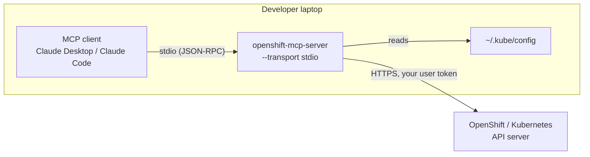
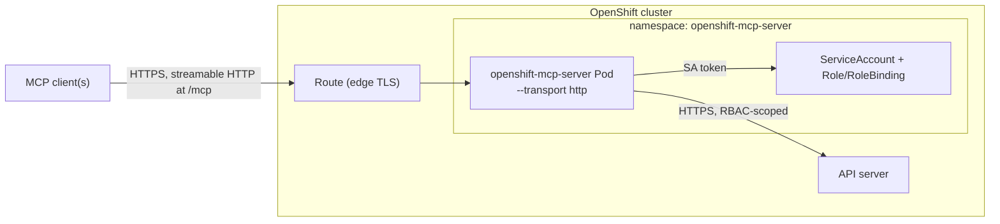
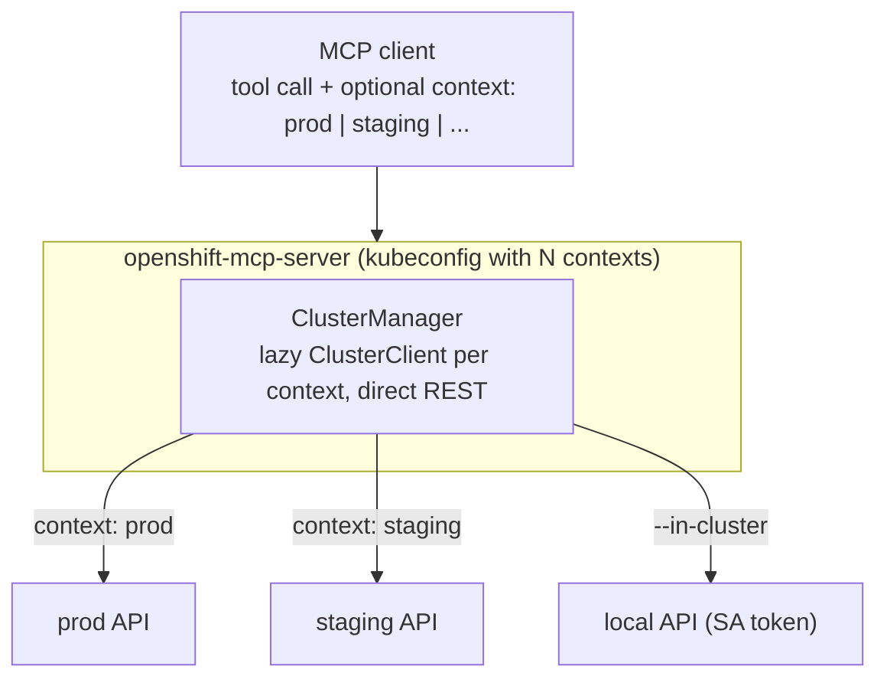

# openshift-mcp-server

An [MCP](https://modelcontextprotocol.io) server, written in Python on the official MCP SDK's
`MCPServer` (`mcp` ≥ 2.1 — the class FastMCP became when it moved into the SDK), that exposes
OpenShift/Kubernetes cluster operations as tools for MCP clients (Claude Desktop, Claude Code,
and others).

It talks to the cluster API **directly** — no `oc`/`kubectl` on the host — and is built around a
small set of **generic resource tools** rather than one tool per kind.

| Config | Tools | Surface |
|---|--:|---|
| default | 12 | reads + non-destructive writes (apply, scale, restart, trigger) |
| `--read-only` | 8 | list / get / log only |
| `--no-disable-destructive` | 13 | default + `resources_delete` |
| `--toolsets core` | 6 | `core` toolset only |

## How it works

- **Generic resource tools.** `resources_list` / `resources_get` / `resources_apply` /
  `resources_scale` / `resources_delete` operate on *any* GVK (`kind` + `apiVersion`), including
  CRDs and OpenShift types. A few specials stay dedicated: `pods_log`, `events_list` (ordering),
  `workloads_restart`, `builds_trigger` (subresources).
- **Toolsets.** Tools are grouped and enabled with `--toolsets`:

  | Toolset | Default | Tools |
  |---|---|---|
  | `core` | ✓ | `resources_list`, `resources_get`, `resources_apply`, `resources_scale`, `resources_delete`, `pods_log`, `events_list` |
  | `config` | ✓ | `contexts_list`, `configuration_view` |
  | `openshift` | ✓ | `projects_list`, `routes_list`, `workloads_restart`, `builds_trigger` |

- **Two safety gates.** `--read-only` registers only the list/get/log tools.
  `--disable-destructive` (default **on**) withholds `resources_delete`. So the default surface is
  *read + non-destructive writes* (apply, scale, restart, trigger); nothing deletes.
- **Result hygiene.** Every returned object is stripped of `managedFields` and the
  `last-applied-configuration` annotation before it reaches the model — typically 50–70% smaller,
  with no loss of signal. List tools are capped (`--list-limit`) and logs tail-capped
  (`--log-max-lines`).
- **Multi-cluster** via kubeconfig contexts. Every tool takes an optional `context` argument;
  `contexts_list` names them (add `probe=true` to also check reachability + OpenShift, done
  concurrently). Per-context clients are built lazily, resolving a kind to its REST path costs
  one cached request, and every call is time-bounded (`--request-timeout`) — an unreachable
  cluster fails in seconds, never hangs.
- **Transports:** `stdio` (local clients) and streamable **HTTP** (`--transport http`), the latter
  serving the MCP endpoint at `/mcp` plus `/healthz` and `/readyz`.

## Architecture

### A — local, stdio (single developer)

The MCP client launches the server as a child process and talks over stdin/stdout. It reuses
your `~/.kube/config`; nothing is exposed on the network.



### B — in-cluster, streamable HTTP (shared)

One Deployment per cluster, authenticating as its ServiceAccount, so its reach is exactly the
RBAC in `deploy/role.yaml`. Put an auth proxy in front of the Route (see [Security](#security)).



### C — one server, many clusters

A single server (local or in-cluster) resolves the tool's optional `context` argument to a
kubeconfig context; `contexts_list` enumerates them. Clients are lazy and cached per context.



## Authentication

The server implements no authorization of its own — it acts with whatever credentials it runs
with, and RBAC is the only boundary. Credential source, in order:

1. **`--in-cluster`** or, when no kubeconfig is found, the pod's mounted ServiceAccount.
2. **kubeconfig** — `--kubeconfig` / `KUBECONFIG` / `~/.kube/config`, honoring `--context`.
   Every context in the file is selectable via the `context` tool argument.

## Install & run

```sh
python -m venv .venv && . .venv/bin/activate      # Windows: .venv\Scripts\activate
pip install -e ".[dev]"

make test        # pytest
make lint        # ruff check + format --check
make run         # stdio
make run-http    # http on 127.0.0.1:8080
```

### Configuration

Flags win over `MCP_*` env vars over a `--config` TOML file over defaults.

| Flag | Env | Default | Purpose |
|---|---|---|---|
| `--transport` | `MCP_TRANSPORT` | `stdio` | `stdio` or `http` |
| `--host` / `--port` | `MCP_HOST` / `MCP_PORT` | `127.0.0.1` / `8080` | HTTP listen address |
| `--kubeconfig` | `KUBECONFIG` | *(discovery)* | kubeconfig path |
| `--context` | `MCP_CONTEXT` | *(active context)* | default context |
| `--in-cluster` | `MCP_IN_CLUSTER` | `false` | force ServiceAccount creds |
| `--read-only` | `MCP_READ_ONLY` | `false` | only list/get/log tools |
| `--disable-destructive` / `--no-disable-destructive` | `MCP_DISABLE_DESTRUCTIVE` | `true` | withhold `resources_delete` |
| `--toolsets` | `MCP_TOOLSETS` | `core,config,openshift` | enabled toolsets |
| `--list-limit` | `MCP_LIST_LIMIT` | `200` | max items per list |
| `--log-max-lines` | `MCP_LOG_MAX_LINES` | `500` | max `pods_log` lines |
| `--request-timeout` | `MCP_REQUEST_TIMEOUT` | `30` | per-call timeout (s) |
| `--list-output` | `MCP_LIST_OUTPUT` | `json` | `json` or `yaml` |
| `--log-level` | `MCP_LOG_LEVEL` | `INFO` | |

## Connecting Claude

### Local (stdio) — Claude Desktop / Claude Code

Claude Desktop launches the server itself; add to `claude_desktop_config.json`:

```json
{
  "mcpServers": {
    "openshift": {
      "command": "/abs/path/.venv/bin/openshift-mcp-server",
      "args": ["--transport", "stdio", "--read-only"]
    }
  }
}
```

(On Windows use `.venv\\Scripts\\openshift-mcp-server.exe` with escaped backslashes.) Fully quit
and reopen Claude Desktop. It uses `~/.kube/config` automatically.

### In-cluster (HTTP)

```sh
oc new-project openshift-mcp-server
oc apply -f deploy/serviceaccount.yaml -f deploy/role.yaml -f deploy/rolebinding.yaml
oc apply -f deploy/deployment.yaml   # set the image first
oc apply -f deploy/service.yaml
oc apply -f deploy/route.yaml         # optional; see Security
```

The endpoint is `https://<route-host>/mcp`. Connect Claude Code with
`claude mcp add --transport http openshift https://<route-host>/mcp`, or Claude Desktop via a
custom connector / an `npx mcp-remote` bridge.

## Security

The HTTP transport has **no authentication**; anyone who reaches it acts with the pod's RBAC,
writes included. So:

- Prefer stdio for single-user use.
- Don't expose `deploy/route.yaml` as-is — put an authenticating proxy in front and a
  `NetworkPolicy` behind it.
- Run `--read-only` unless you need writes. Drop the write rule in `deploy/role.yaml` to enforce
  read-only at the RBAC layer too.
- `resources_delete` is off unless you pass `--no-disable-destructive` **and** grant `delete` in
  the Role.

## Container image

```sh
make image        # podman if present, else docker; -f Containerfile
```

Two-stage build on Red Hat UBI: `ubi9/python-312` for the build, `ubi9/python-312-minimal` for
the runtime (a venv, non-root).

## Layout

```
src/openshift_mcp/
  config.py      flags / env / TOML
  k8s.py         ClusterClient (direct REST, bounded, no discovery) + ClusterManager + probes
  sanitize.py    strip managedFields / noise annotations
  errors.py      ApiException -> clear ToolError messages
  toolsets/      core.py, config.py, openshift.py  (+ __init__: Deps, serialize, clamps, registry)
  server.py      build MCPServer, wire toolsets, run transport (+ /healthz /readyz)
  cli.py         entry point
tests/           fakes.py + pytest suite (no cluster needed)
```
